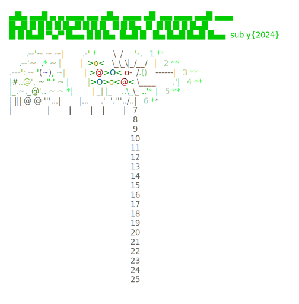

# Advent of Code
This is my solutions for the [Advent of Code](https://adventofcode.com) challenges.
I have been doing this in c# to improve my skills in the language.
The latest challenge can be seen here:


## Template
This repositiory is based on the [AoC template](https://github.com/encse/adventofcode-template) by [encse](https://github.com/encse).
All credits to him for the template.

## Dependencies

- Based on `.NET 9` and `C# 13` 
- `AngleSharp` is used for problem download
- `git-crypt` to store the input files in an encrypted form
- the optional `Memento Inputs` extension for Visual Studio Code

## Getting started in 5 steps

1. Clone the repo
2. Install .NET
3. Install and initialize git-crypt:

```
> brew install git-crypt
> cd repo-dir
> git-crypt init
> git-crypt export-key ~/aoc-crypt.key
```

Don't commit `aoc-crypt.key` into a public repo, back it up in some protected place. 
If you need to clone your repo later you will need to unlock it using this key such as:

```
> git clone ...
> cd repo-dir
> git-crypt unlock ~/aoc-crypt.key
```
4. export your SESSION cookie from the adventofcode.com site in your terminal as an env variable:

```
> export SESSION=djsaksjakshkja...
```

5. Get help with `dotnet run` and start coding.

## Working in Visual Studio Code
If you prefer, you can work directly in VSCode as well. 

Open the command Palette (⇧ ⌘ P), select `Tasks: Run Task` then e.g. `update today`.

Work on part 1. Check the solution with the `upload today` task. Continue with part 2.

**Note:** this feature relies on the "Memento Inputs" extension to store your session cookie, you need 
to set it up in advance from the Command Palette with `Install Extensions`.
